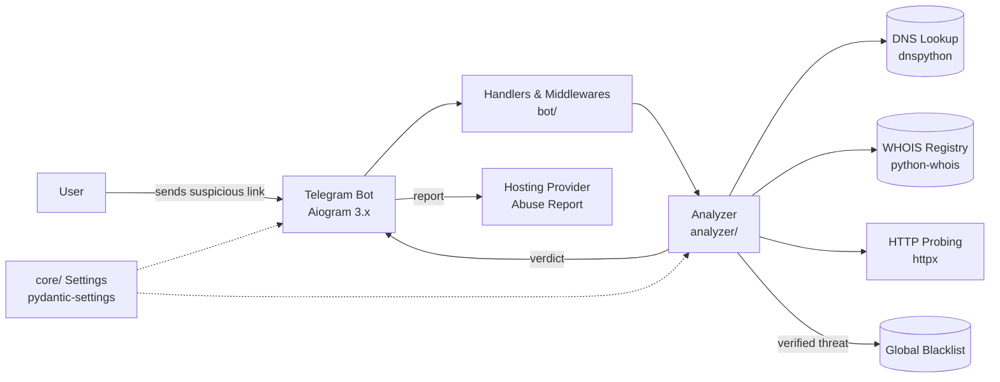

# SafeNet UZ 🇺🇿

> Open-source cybersecurity ecosystem protecting Uzbekistan's digital space from phishing attacks, fake bots, and malicious Android applications (malware APK).

[](LICENSE)
[](https://www.python.org/downloads/)
[](https://docs.aiogram.dev)
[](README.md#contributing)

## Mission

"SafeNet UZ" is a **crowdsourced** cyber-security initiative. Users forward suspicious links to a Telegram bot; the system analyzes them **asynchronously**, cross-checks DNS/WHOIS/GEO data, and automatically sends **Abuse Reports** to the relevant hosting providers — while publishing verified threats to global blacklists.

### How it works

```
1. Foydalanuvchi shubhali havolani botga yuboradi
        │
        ▼
2. URL normalizatsiya va parslanadi (url_parser)
        │
        ▼
3. DNS + WHOIS + GEO ma'lumotlari asinxron yig'iladi (httpx, dnspython, python-whois)
        │
        ▼
4. Reputatsiya bali hisoblanadi → verdict (XAVFLI / SHUBHALI / XAVFSIZ)
        │
        ▼
5. XAVFLI deb tasdiqlanganlar: hosting provayderga Abuse Report + global qora ro'yxat
```

### Core capabilities

| Capability | Description |
|---|---|
| 🕵️ Link analysis | Async URL phishing detection pipeline |
| 🌐 DNS & WHOIS checks | `dnspython` + `python-whois` enrichment |
| 🚨 Automatic Abuse Reports | Verified threats reported to hosting/abuse contacts |
| 📚 Global blacklists | Crowdsourced denial-of-service for phishing networks |
| 🤖 Telegram-first UX | Zero-install reporting via [Aiogram 3.x](https://docs.aiogram.dev) |
| ⚡ Async by design | Non-blocking analysis with `httpx` + `asyncio` |

## Architecture



### Folder structure

```
safenetuz/
├── .github/workflows/ci.yml   # CI pipeline
├── bot/
│   ├── handlers/              # Telegram message handlers
│   ├── middlewares/           # Bot middlewares
│   └── main.py                # Async entry point
├── analyzer/
│   ├── url_parser.py          # URL normalization & parsing
│   └── whois_checker.py       # WHOIS enrichment
├── core/
│   └── config.py              # Typed, validated settings
├── Dockerfile
├── docker-compose.yml
├── requirements.txt
└── .env.example
```

## Tech stack

- **Python 3.11+**
- **Aiogram 3.x** — Telegram Bot API
- **httpx** — async HTTP probing
- **dnspython** & **python-whois** — DNS/WHOIS enrichment
- **pydantic** & **pydantic-settings** — safe, validated configuration
- **Docker & Docker Compose** — containerized deployment

## Getting started

### 1. Clone & configure

```bash
git clone git@github.com:<your-username>/SafeNet-UZ.git
cd SafeNet-UZ

python -m venv .venv
source .venv/bin/activate
pip install -r requirements.txt

cp .env.example .env
```

Then fill `.env` with your bot token (from [@BotFather](https://t.me/BotFather)):

```
BOT_TOKEN=1234567890:AAE...
LOG_LEVEL=INFO
```

### 2. Run locally

```bash
python -m bot.main
```

> `bot_token` is required and stored as a `SecretStr` — it is never logged or exposed.

### 3. Run with Docker

```bash
docker compose up -d --build
docker compose logs -f bot
```

### 4. Verify the pipeline

Start the bot, open your chat, and send `/start` followed by a test URL. The reporting flow returns a structured analysis verdict.

## Contributing

We welcome contributors of all levels.

1. **Fork** the repository and create a feature branch:
   ```bash
   git checkout -b feat/your-feature
   ```
2. **Keep it clean**: follow the existing module layout; all package imports must be import-safe (see CI).
3. **Commit** with a descriptive message and open a **Pull Request** against `main`.

### Development guidelines

- Python 3.11+, type hints required for all public functions.
- Secrets must never reach code, logs, or commits.
- Add a test case for every new analyzer rule.
- Run `python -m compileall -q bot analyzer core` before pushing.

## Security policy

### Reporting a vulnerability

Found a security issue? **Do not open a public issue.**

- Email: `security@safenet.uz`
- Scope: bot source code, analyzer logic, abuse-report pipeline, CI/CD.

We commit to acknowledging reports within **48 hours** and releasing fixes as part of the next patch release. Cheerful disclosure is part of the culture here. 🙏

### Threat intelligence safety

- All source URLs are **sanitized** before any outbound request.
- Abuse Reports are only sent for **verified** threats.
- Crowdsourced blacklist entries are reviewed before publication.

## License

Distributed under the **MIT License**. See [LICENSE](LICENSE).

---

**SafeNet UZ** — protecting Uzbekistan's digital space, together. 🇺🇿